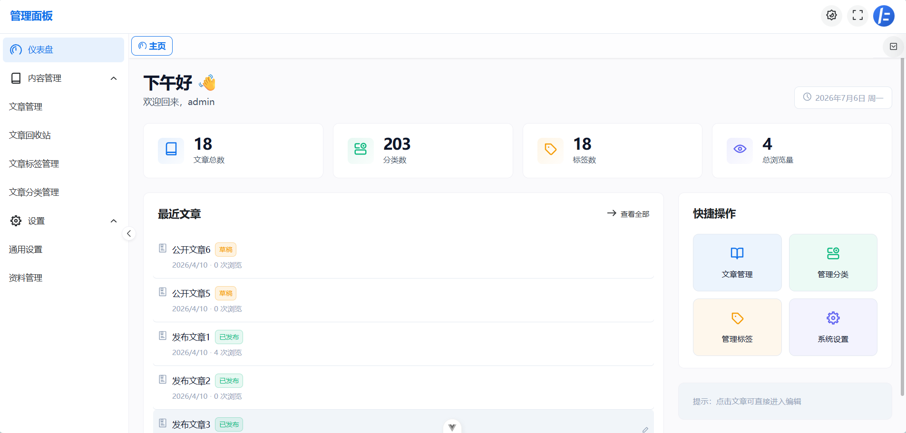

# kzhikcn-admin

<p align="center">
  
  
  
  
  
  
</p>

<p align="center">
  基于 Vue 3 构建的轻量级 Headless CMS 管理后台，专为 <strong>kzhikcn-api</strong> 设计。
</p>

---

## 项目简介

**kzhikcn-admin** 是 **kzhikcn-api** 的官方管理后台。

采用前后端分离架构，后端专注提供 API，后台负责内容管理，前端可以是博客、静态网站、移动应用或其他任意客户端。

---

## 项目预览

<p align="center">
  
</p>

---

## 功能特性

### 内容管理

* 📝 文章管理
* ✍️ Markdown 编辑器
* 📁 文章资源管理
* 🗂️ 分类管理
* 🏷️ 标签管理
* 🗑️ 回收站
* 📚 分类 / 标签文章浏览

### 系统功能

* 📊 数据概览
* 👤 用户资料
* 🔐 修改密码
* 🛡️ MFA（TOTP）
* 🌗 深色 / 浅色主题
* 🗂️ 多标签页

---

## 技术栈

| 分类           | 技术                     |
| ------------ | ---------------------- |
| 框架           | Vue 3（Composition API） |
| 语言           | TypeScript             |
| 构建工具         | Vite                   |
| UI           | Naive UI               |
| 状态管理         | Pinia                  |
| 路由           | Vue Router             |
| 网络请求         | Axios                  |
| Markdown 编辑器 | md-editor-v3           |

---

## 快速开始

### 安装依赖

```bash
npm install
```

### 启动开发服务器

```bash
npm run dev
```

浏览器访问：

```text
http://localhost:5173
```

首次启动需要：

1. 在登录页配置后端 API 地址。
2. 使用后端创建的管理员账号登录。

> 后端部署方式请参考 [kzhikcn-api](https://github.com/kzhikcn/kzhikcn-api) 文档。

---

## 构建项目

```bash
npm run build
npm run preview
npm run type-check
```

---

## 开发说明

### 布局

应用根据登录状态自动切换布局：

* `LoginLayout`
* `MainLayout`

侧边栏菜单由路由配置自动生成，支持图标、标题及隐藏菜单。

### API 请求

统一使用：

* `useFetch()`：获取数据
* `useAction()`：执行操作

请求拦截器自动完成：

* 注入 API 地址
* 注入用户 Token
* 未授权状态处理
* 登录状态维护

---

## 相关项目

* **[kzhikcn-api](https://github.com/kzhikcn/kzhikcn-api)** —— Headless CMS 后端（Go）
